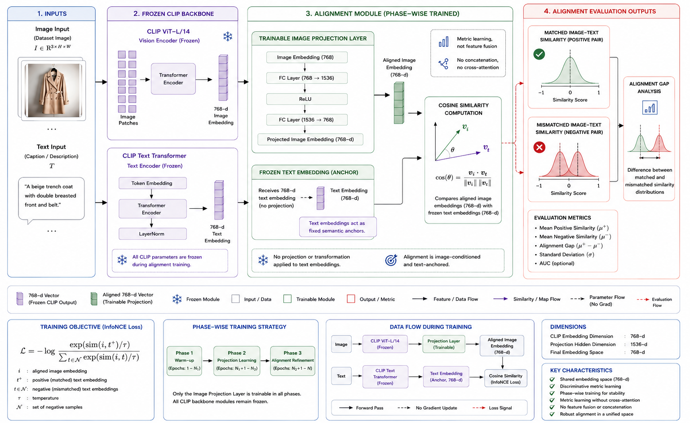

# Vision-Language Image-Text Alignment for Fashion Recommendation

Official implementation of the image-text alignment framework proposed in the Springer publication:

> **Vision-Language Models for Fashion Conversational Assistants with Multimodal Dialogues**

This repository implements a lightweight image-text alignment framework for the fashion domain using a **frozen EVA02-CLIP foundation model** and a **trainable Projection Head** optimized with a **Hybrid Alignment Loss**.

<p align="center">

[]()
[]()
[]()
[]()

</p>

---

# Overview

The framework aligns fashion images and textual descriptions into a shared embedding space while training only a lightweight projection network.

Unlike conventional multimodal fine-tuning approaches, the vision encoder and text encoder remain completely frozen throughout training.

Only the Projection Head is optimized using a hybrid objective consisting of:

- Normalized Mean Squared Error (NMSE)
- InfoNCE Contrastive Loss

This significantly reduces trainable parameters while maintaining strong image-text alignment.

---

## Key Contributions

- Phase-wise Image–Text Alignment Framework
- Frozen EVA02-CLIP Vision Encoder
- Frozen CLIP Text Embedding Space
- Lightweight Trainable Projection Layer
- Metric Learning based Alignment
- Hybrid InfoNCE + Normalized MSE Optimization
- Positive Image-Text Similarity
- Negative Image-Text Similarity
- Alignment Gap
- Out-of-Domain (OOD) Validation
- Ablation Studies
- LoRA Baseline Comparison

---

# Architecture

<p align="center">



</p>

```

# Repository Structure

```text
FashionAlignment/

│
├── configs/
│   └── config.py
│
├── src/
│   ├── encoders.py
│   ├── projector.py
│   ├── model.py
│   ├── losses.py
│   ├── metrics.py
│   ├── checkpoint.py
│   └── inference.py
│
├── training/
│   ├── datasets.py
│   ├── trainer.py
│   ├── phase1.py
│   ├── phase2.py
│   └── phase3.py
│
├── checkpoints/
│
├── datasets/
│
├── outputs/
│
├── figures/
│
├── requirements.txt
│
└── README.md
```

---

# Methodology

The framework consists of three components:

- Frozen EVA02-CLIP Vision Encoder
- Frozen CLIP Text Encoder
- Trainable Projection Head

During training:

- Image embeddings are extracted using the frozen vision encoder.
- Text embeddings are extracted using the frozen CLIP text encoder.
- Image embeddings are projected into the shared embedding space.
- The Projection Head is optimized using the Hybrid Alignment Loss.

Both encoders remain frozen during the entire training procedure.

---

# Hybrid Alignment Loss

The Projection Head is optimized using

```
Hybrid Loss

=

λ × NMSE

+

(1 − λ) × InfoNCE
```

where

- NMSE improves embedding regression.
- InfoNCE improves discriminative alignment.

---

# Datasets

The implementation supports multiple fashion datasets.

Recommended datasets:

- DeepFashion
- Polyvore
- FashionIQ
- Amazon Fashion

The training CSV should contain

```
image,caption
dress001.jpg,Red floral summer dress
shirt017.jpg,Blue denim shirt
...
```

Images should be stored under

```
datasets/images/
```

---

# Installation

Clone the repository

```bash
git clone <repository-url>

cd FashionAlignment
```

Create environment

```bash
python -m venv .venv
```

Activate

Windows

```bash
.venv\Scripts\activate
```

Linux

```bash
source .venv/bin/activate
```

Install dependencies

```bash
pip install -r requirements.txt
```

---

# Training

Train the Projection Head

```bash
python training/phase1.py
```

This trains only the Projection Head while keeping both EVA02-CLIP encoders frozen.

---

# Phase-2 Evaluation

Evaluate the trained Projection Head

```bash
python training/phase2.py
```

Metrics reported

- Mean Positive Similarity
- Mean Negative Similarity
- Alignment Gap
- Positive Similarity Standard Deviation

---

# Phase-3 Refined Evaluation

Run the final evaluation

```bash
python training/phase3.py
```

Results are exported for further analysis.

---

# Inference

Example

```python
from src.inference import ImageTextInference

engine = ImageTextInference()

score = engine.similarity(
    "dress.jpg",
    "Red floral summer dress"
)

print(score)
```

Ranking captions

```python
captions = [
    "Red floral summer dress",
    "Blue denim shirt",
    "Black leather handbag"
]

results = engine.predict(
    "dress.jpg",
    captions
)

for r in results:
    print(r)
```

---

# Evaluation Metrics

The repository reports

- Mean Positive Similarity
- Mean Negative Similarity
- Alignment Gap
- Positive Similarity Standard Deviation

These correspond to the evaluation protocol described in the paper.

---

# Checkpoints

Projection Head checkpoints are stored in

```
checkpoints/
```

Example

```
projector_phase1.pt

projector_phase2.pt

projector_phase3.pt
```

---

# Reproducibility

Random seeds are fixed throughout training.

Only the Projection Head is trainable.

Both EVA02-CLIP encoders remain frozen.

The implementation follows the methodology described in the accompanying publication.

---

# Citation

If you use this repository, please cite:

```bibtex
@article{YOUR_CITATION,
  title   = {Vision-Language Models for Fashion Conversational Assistants with Multimodal Dialogues},
  author  = {Author Names},
  journal = {Springer},
  year    = {2026}
}
```

---

# Acknowledgements

This work builds upon the following open-source projects:

- OpenCLIP
- EVA02-CLIP
- PyTorch
- Hugging Face
